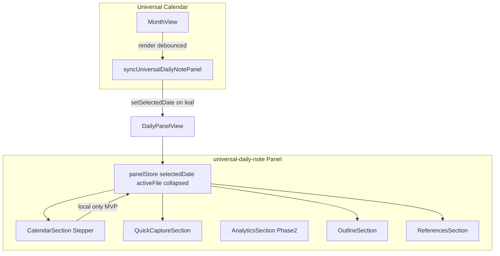

# Universal Daily Note — Implementierungsplan

## Ausgangslage

[`/workspace/plugin`](/workspace/plugin) (`universal-daily-note`) hat heute:

- Rechtes Panel unten (`DailyPanelView`, `ensureSideLeaf` mit `split: true`)
- **Nur** Tagebuch-Verweise ([`DailyPanel.svelte`](/workspace/plugin/src/panel/DailyPanel.svelte), [`tagebuchVerweise.ts`](/workspace/plugin/src/tagebuchVerweise/tagebuchVerweise.ts))
- Kalender-Readonly-Helfer ([`universalCalendar.ts`](/workspace/plugin/src/integrations/universalCalendar.ts): `getSelectedDate` only)
- Daily-Note-Logik wiederverwendbar ([`dailyNote.ts`](/workspace/plugin/src/notes/dailyNote.ts), [`dailyNotesCore.ts`](/workspace/plugin/src/notes/dailyNotesCore.ts))

**Ziel:** Dreigeteiltes Panel (Kalender-Sync oben, Schnelleingabe/Auswertung Mitte, Outline + Verweise unten) — **ohne** eigenes Monatsraster.

**Entscheidung (Option A):** Kalender → Panel per Push (DNO-Muster). Panel-Stepper ändert nur den lokalen Store; **kein** Rückkanal zum Kalender in MVP.

---

## Zielarchitektur



### Panel-Struktur (Svelte)

[`DailyPanel.svelte`](/workspace/plugin/src/panel/DailyPanel.svelte) wird dünne Hülle:

- Erzeugt [`panelStore.ts`](/workspace/plugin/src/panel/panelStore.ts) (`selectedDate`, `activeFile`, `collapsed`)
- Registriert **alle** Obsidian-Listener zentral in `onMount` (workspace/metadata/vault); Kind-Sektionen **keine** eigenen Listener
- Rendert klappbare Sektionen unter [`src/panel/sections/`](/workspace/plugin/src/panel/sections/)

| Sektion                 | Datei                        | MVP                  |
| ----------------------- | ---------------------------- | -------------------- |
| Kalender-Sync + Stepper | `CalendarSection.svelte`     | ja                   |
| Schnelleingabe          | `QuickCaptureSection.svelte` | ja                   |
| Auswertung              | `AnalyticsSection.svelte`    | Phase 2              |
| Outline                 | `OutlineSection.svelte`      | ja                   |
| Tagebuch-Verweise       | `ReferencesSection.svelte`   | ja (1:1 ausgelagert) |
| Wrapper                 | `CollapsibleSection.svelte`  | ja                   |

Wiring: [`mountDailyPanel.ts`](/workspace/plugin/src/panel/mountDailyPanel.ts) und [`dailyPanelView.ts`](/workspace/plugin/src/views/dailyPanelView.ts) übergeben `plugin` (Settings + `saveSettings`), nicht nur `app`. View-Titel: **„Tägliche Notiz"**.

---

## Kalender-Integration (Push-only, DNO-Muster)

Vorbild: [`dailyNoteOutline.ts`](/workspaces/SoftwareEntwicklung/obsidian-universal-calendar-plugin/src/integrations/dailyNoteOutline.ts)

### Kalender-Plugin (kleine Erweiterung)

Neue Datei `obsidian-universal-calendar-plugin/src/integrations/universalDailyNote.ts`:

```ts
const UDN_VIEW_TYPE = "universal-daily-note-panel";
export function syncUniversalDailyNotePanelToSelectedDate(
  app: App,
  date: Date,
): void {
  for (const leaf of app.workspace.getLeavesOfType(UDN_VIEW_TYPE)) {
    const view = leaf.view as { setSelectedDate?: (d: Date) => void };
    view.setSelectedDate?.(date);
  }
}
```

In [`monthView.ts`](/workspaces/SoftwareEntwicklung/obsidian-universal-calendar-plugin/src/ui/monthView.ts):

- Neben `syncDnoDebounced` einen debounced Aufruf `syncUdnDebounced`
- In `render()` am Ende aufrufen (wie DNO, Zeile ~273)
- Gated über neue Setting `syncDailyNotePanel: boolean` in [`settings.ts`](/workspaces/SoftwareEntwicklung/obsidian-universal-calendar-plugin/src/settings.ts) + Toggle in Settings-Tab

### Daily-Note-Plugin

[`DailyPanelView`](/workspace/plugin/src/views/dailyPanelView.ts) erhält öffentliche Methode:

```ts
setSelectedDate(date: Date): void {
  this.panelStore?.selectedDate.set(normalizeLocalDay(date));
}
```

[`CalendarSection.svelte`](/workspace/plugin/src/panel/sections/CalendarSection.svelte):

- Zeigt kompakten Tages-Stepper (‹ Heute ›) + `formatUniversalCalendarDayLabel`
- Stepper schreibt **nur** in `panelStore.selectedDate` (MVP: kein Kalender-Rückruf)
- Initialisierung: `getUniversalCalendarSelectedDate(app) ?? new Date()`

**Graceful degradation:** Kalender fehlt oder Setting aus → Panel läuft über eigenen Stepper; Push ist no-op (`setSelectedDate?.()`).

---

## Neue Hilfsmodule (daily-note-Plugin)

| Modul                                                              | Aufgabe                                                                                                                                                                             |
| ------------------------------------------------------------------ | ----------------------------------------------------------------------------------------------------------------------------------------------------------------------------------- |
| [`appendLogLine.ts`](/workspace/plugin/src/notes/appendLogLine.ts) | Schnelleingabe: `openOrCreateDailyNoteForDate` falls nötig, atomar via `app.vault.process`, optional `[[basename]]`-Auto-Link aus `activeFile`, optional Insert unter `headingPath` |
| [`headings.ts`](/workspace/plugin/src/notes/headings.ts)           | Outline aus `metadataCache.getFileCache(file)?.headings`; Klick → `openLinkText` + `setEphemeralState({ line })`                                                                    |
| [`analytics.ts`](/workspace/plugin/src/notes/analytics.ts)         | Phase 2: Streak/Monatszählung über `getDailyNoteOccupiedLocalDaysSync`                                                                                                              |

Unverändert wiederverwenden: `findTagebuchVerweise`, `getMainAreaActiveMarkdownFile`, `openOrCreateDailyNoteForDate`.

---

## Gemeinsames CSS (`@denkarium/obsidian-lib-ui`)

Neue wiederverwendbare Klassen in [`packages/lib-ui/src/components.css`](/workspace/obsidian-platform/packages/lib-ui/src/components.css) + `dk`-Map in [`index.ts`](/workspace/obsidian-platform/packages/lib-ui/src/index.ts):

- Klappbare Sektion: `dk-section`, `dk-sectionHeader`, `dk-sectionChevron`, `dk-sectionBody`, `dk-section--collapsed`
- Eingaben: `dk-input`, `dk-textarea`
- Button: `dk-btn`, `dk-btn--primary`
- Stats: `dk-statRow`, `dk-statLabel`, `dk-statValue`
- Responsive: `@media (max-width:480px)` + `body.is-mobile` (Touch-Targets)

[`styles.plugin.css`](/workspace/plugin/styles.plugin.css) nur noch echte `udn-*`-Spezialfälle. Nach lib-ui-Änderung: `npm run build:css` in allen betroffenen Plugins.

---

## Settings

Erweiterung [`settings.ts`](/workspace/plugin/src/settings.ts) + [`settingsTab.ts`](/workspace/plugin/src/settingsTab.ts):

```ts
quickCapture: { enabled, timeFormat: "HH:mm", headingPath: null, autoLinkActive: true }
analytics: { enabled: false }           // Phase 2
sections: { collapsed: Record<SectionId, boolean> }
```

`loadSettings` in [`main.ts`](/workspace/plugin/src/main.ts): Deep-Merge für neue Unterobjekte (wie `tagebuchVerweise`). Klappzustand via `plugin.saveSettings()` beim Toggle.

**Kleiner Fix nebenbei:** [`main.ts`](/workspace/plugin/src/main.ts) Zeile 47–52 — `onLayoutReady` liefert `void`, kein `EventRef`. Statt `registerEvent(...)` direkt `this.app.workspace.onLayoutReady(() => { ... })` aufrufen.

---

## Phasen

### Phase 1 — MVP

1. lib-ui: Sektions-/Input-/Button-CSS
2. Kalender: `syncUniversalDailyNotePanel` + Setting
3. Panel: Store, `CollapsibleSection`, Sektions-Split, `DailyPanelView.setSelectedDate`
4. Schnelleingabe + Outline
5. Verweise 1:1 in `ReferencesSection` auslagern
6. Settings + Klapp-Persistenz
7. Tests: `appendLogLine`, `headings`, Push-Sync (Stub)

### Phase 2

- `AnalyticsSection` (Streaks, Monatszählung)
- Frontmatter-Slider (Stimmung/Gewohnheiten) via `processFrontMatter`

### Phase 3 (optional)

- Echtes Einbetten der `MonthView`-DOM im Panel (bewusst **nicht** MVP — fragil)

---

## Verifikation

1. Kalender-Plugin bauen + deployen, dann daily-note: `npm run build:css && npm run build`
2. `npm test` (Vitest + [`obsidian-stub.ts`](/workspace/plugin/src/test/obsidian-stub.ts))
3. Manuell im Vault:
   - Datum im Kalender wählen → Panel-Datum/Outline/Capture-Ziel aktualisiert
   - Panel-Stepper → nur Panel ändert sich (Kalender bleibt)
   - Kalender deaktiviert → Panel eigenständig
   - Schnelleingabe in offener Daily Note → `vault.process`, Zeile erscheint
   - Verweise folgen Hauptseite (locate-fixed-Toggle unverändert)

---

## Risiken

| Risiko                      | Mitigation                                 |
| --------------------------- | ------------------------------------------ |
| Kalender-Version fehlt Sync | Panel-Stepper + init aus `getSelectedDate` |
| Listener-Leaks              | Nur ein `onMount`-Teardown in `DailyPanel` |
| Schreiben in offene Notiz   | `vault.process`, nicht read+modify         |
| CSS-Drift                   | Neue UI nur in lib-ui                      |
